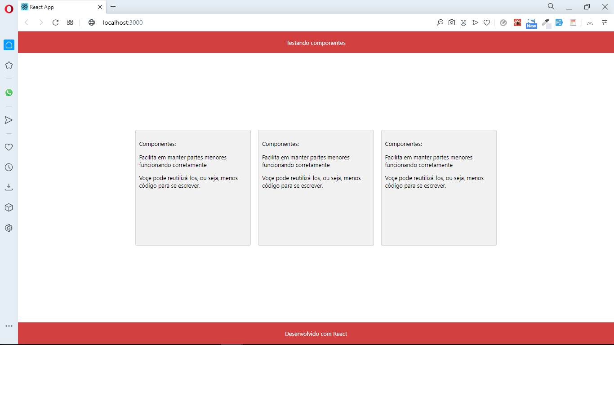

<h1 align='center'>Componentes</h1> 
---

 ### Projeto desenvolvido seguindo os passos do curso da DevMedia "Construindo meus primeiros componentes"

#### Conceitos abordados

- React
    - Entendendo o que é um componente
    - importançia de trabalhar com componentes
    - Estrutura de pastas
    - Entendendo o qué é JSX
    - Sintaxe do JSX

 - Componentes
    - Criando
    - Exportando
    - Importando
    - Renderizando
    - Estilizando

## Layout
---

        
    

